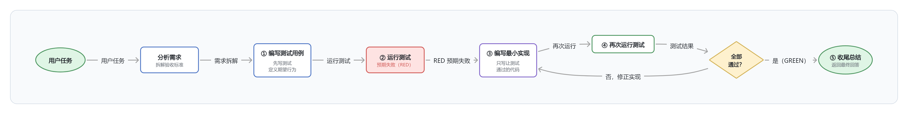
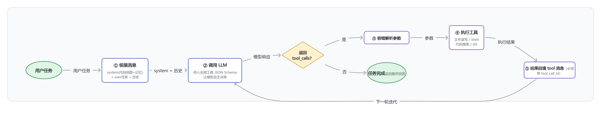

# Coding Agent

基于自研 ReAct Agent 框架扩展的 AI 编程助手，内置 **TDD（测试驱动开发）循环**，能自动完成"写测试 → 跑测试（RED）→ 写实现 → 再跑测试（GREEN）"的完整开发流程。

## 功能特性

- 🔧 **自研 ReAct 循环**：Thought → Action → Observation 主循环，LLM 自主决定调用哪些工具
- 🧪 **TDD 模式**：强制先写测试再写实现，红绿循环直到全部通过
- 🗺️ **Repo Map**：从代码库提取关键符号（函数/类/导入），按重要性排序生成 token 预算内的代码地图
- 🧠 **三层记忆**：
  - 短期记忆（对话历史，超预算自动压缩摘要）
  - 任务状态（目标/步骤/约束，自动维护）
  - 项目记忆（技术栈/编码规范/经验教训，持久化到 `.coding_agent/project_memory.json`）
- 🛠️ **9 个内置工具**：文件读写改、Shell 命令、代码搜索、Git 操作
- 🔄 **工具调用容错**：参数容错解析（markdown 代码块/单引号/末尾逗号/控制字符）、执行错误回填给 LLM 自行修正
- 📊 **Token 精确计数**：基于 tiktoken，超预算自动压缩旧消息为摘要

## 项目定位：与主流 Coding Agent 的对比

本项目定位为**教学/学习级**自研 Coding Agent，对标 Aider / Claude Code 这类 CLI 自主型产品，核心价值是**完全自研、透明可控**——每一层（ReAct 循环、工具系统、记忆管理、TDD 流程）都可以逐行解释。

### 差异化亮点（主流产品反而没有）

| 亮点 | 说明 |
|---|---|
| 🧪 **强制 TDD 循环** | 主流 agent 是"帮你写代码"，TDD 只是可选项；本项目 **强制**先写测试 → 跑测试（RED）→ 写实现 → 再跑（GREEN），直到全部通过 |
| 🔍 **全自研可解释** | 从 ReAct 循环到 token 预算管理，全部自研实现，无黑盒依赖，适合学习与面试讲解 |

### 能力对比（主观评估，0-5 分）

| 能力维度 | 本项目 | 产品级（Cursor / Claude Code / Aider） | 企业级（Devin） |
|---|---|---|---|
| 代码/仓库理解 | 2（AST RepoMap） | 4（语义索引） | 4 |
| 工具生态 | 2（9 个工具） | 4（20-50+） | 5（云端全工具） |
| 上下文与记忆管理 | 2（2000 token 预算） | 4（200k 上下文） | 5 |
| **TDD/测试纪律** | **5（强制）** | 3（可选） | 3 |
| IDE/交互集成 | 1（CLI） | 4（IDE 原生） | 3（Web 平台） |
| 安全与权限控制 | 1（直接操作文件） | 4（审批流/沙箱） | 5（隔离环境） |
| 成本/资源管理 | 1（无） | 3（token 统计） | 4 |
| **透明/可解释** | **5（全自研）** | 2（黑盒） | 1 |
| 自主任务完成度 | 3（能跑通 TDD 任务） | 4 | 5 |

### 已知差距

1. **上下文规模**：2000 token 预算即触发压缩，主流为 200k 上下文
2. **IDE 集成**：仅命令行，无编辑器内实时交互
3. **安全沙箱**：直接修改真实文件，无 diff 预览/确认机制
4. **工具生态**：9 个内置工具，缺 web 搜索、CI、截图等
5. **架构**：单循环串行，无 planner/executor 分层与并行子任务
6. **成本控制**：无 token 用量统计与多模型路由

### 产品化路线图（按优先级）

1. **安全确认层**：文件改动前 diff 预览 + 用户确认（从"玩具"到"可用"的分水岭）
2. **上下文升级**：token_budget 提升至 8000-16000，压缩时保真关键信息
3. **TDD 深化**：测试失败原因自动分类（import 错误 / 逻辑错误 / 断言错误，分别给出修复策略）——该方向主流产品尚未做深

## 项目结构

```
src/coding_agent/
├── agent.py              # CodingAgent 主控（ReAct 循环）
├── tdd.py                # TDDAgent（TDD 流程指令，继承 CodingAgent）
├── main.py               # 命令行入口
├── llm.py                # LLM 客户端封装（OpenAI 兼容，tenacity 重试）
├── tool.py               # @tool 装饰器、Tool 类、ToolRegistry（自动生成 JSON Schema）
├── repo_map.py           # 代码库地图（AST 提取符号 + 重要性评分）
├── errors.py             # 自定义异常
├── memory/
│   ├── short_term.py     # 短期记忆（滑动窗口 + 自动压缩）
│   ├── task_state.py     # 任务状态
│   └── project_memory.py # 项目记忆（持久化）
├── tools/
│   ├── file_tools.py     # read_file / write_file / edit_file / list_files
│   ├── shell_tools.py    # run_shell_command
│   ├── code_search.py    # grep_code / glob_files
│   └── git_tools.py      # git_status / git_diff / git_commit
└── utils/
    ├── token_counter.py  # tiktoken 精确计数
    └── json_parser.py    # 容错 JSON 解析
```

## 安装

```bash
# 1. 创建虚拟环境
python -m venv .venv

# 2. 安装依赖
.venv\Scripts\pip install -e ".[dev]"        # Windows
# source .venv/bin/pip install -e ".[dev]"   # Linux/macOS

# 3. 配置 API Key（复制 .env.example 为 .env，填入你的 Key）
#    支持 DeepSeek 或 DashScope（阿里云百炼）
```

## 使用

```bash
# 普通模式：让 Agent 直接完成任务
.venv\Scripts\python -m coding_agent.main "写一个计算斐波那契数列的脚本"

# TDD 模式：强制先写测试再写实现
.venv\Scripts\python -m coding_agent.main --tdd "实现一个函数 is_prime(n)"

# 指定项目目录
.venv\Scripts\python -m coding_agent.main --repo D:\myproject "修复 README 中的错别字"

# 交互模式：不带任务参数启动，连续输入任务
.venv\Scripts\python -m coding_agent.main
```

## TDD 模式工作流程



TDDAgent 通过注入 TDD 流程指令（写测试 → 确认 RED → 写实现 → 确认 GREEN → 收尾）强制遵守测试驱动开发纪律，测试不通过不会进入"完成"状态。

## 工作原理

本项目是一个标准的 **ReAct（Reasoning + Acting）循环** 实现：



关键机制：

- **工具调用循环**：模型每次迭代可以调用 1 个或多个工具，工具结果回填后再次调用模型，直到模型认为任务完成、直接回答
- **错误自愈**：工具不抛异常，而是返回错误字符串（如 `错误: 文件不存在`），模型读到后自行修正参数重试
- **记忆分层**：
  - 短期记忆保存完整对话，超 token 预算时用 LLM 把旧消息压缩成摘要（保留用户需求/已完成工作/待解决问题）
  - 任务状态记录目标、约束、已执行步骤，注入 system prompt 让模型知道"我在哪、做过什么"
  - 项目记忆持久化技术栈、编码规范、经验教训，跨会话积累
- **RepoMap**：用 AST 解析代码库，提取函数/类/导入符号，按"深度 + 符号数 + 入口文件"评分排序，在 token 预算内生成代码地图，让模型不用读全部代码就能了解项目结构

## 测试

```bash
.venv\Scripts\python test_all_tmp.py   # 全模块测试（fake LLM，不耗 API）
```

测试覆盖：文件工具、Shell 工具、代码搜索、Git 工具（真实 git 仓库）、RepoMap、Agent 主循环（验证消息序列、tool_call_id 关联、任务状态记录）。

## 技术要点

- **消息序列**：严格遵守 OpenAI Function Calling 格式（assistant 带 tool_calls → tool 带 tool_call_id），tool 消息缺少 tool_call_id 会报 400
- **工具错误处理**：工具不抛异常，返回错误字符串给 LLM 自行修正
- **输出截断**：工具结果截断（3000 字符/100 字符），防止撑爆上下文
- **Windows 兼容**：所有工具均适配 Windows/PowerShell 环境
- **tool_calls 完整格式**：解析 LLM 响应时保留 `type: "function"` 和 `function` 嵌套结构，否则消息回填时 DeepSeek/OpenAI 会报 `missing field 'type'`

## 免责声明与使用须知

> ⚠️ **请在使用前阅读本节**

### 项目性质

本项目是**教学/学习项目**，用于理解 AI Agent 的底层实现原理（ReAct 循环、工具系统、记忆管理、TDD 自动化）。它不是一个商业级产品，**不建议用于生产环境、重要代码库或无法承受错误的场景**。

### 能力边界

| 项目 | 现状 |
|---|---|
| 模型支持 | 单模型（DeepSeek / DashScope 二选一，无自动故障切换） |
| 上下文管理 | token 预算默认 2000，超出后压缩旧消息为摘要（可能丢失细节） |
| 并发能力 | 单循环串行执行，无并行子任务 |
| 工具范围 | 9 个内置工具，无 web 搜索、CI 集成、截图等 |
| 代码理解 | AST 级别（RepoMap），非语义索引 |
| 交互方式 | 命令行，无 IDE 集成 |

### 使用风险（重要）

1. **工具会直接修改你的文件**：`write_file` / `edit_file` 会真实写入文件，`run_shell_command` 会真实执行命令。**没有 diff 预览、没有撤销机制、没有用户确认流程**。请在临时目录/测试项目中运行，或自行备份。
2. **LLM 可能出错**：模型可能误读需求、写错代码、误用工具参数。所有输出都应人工审查后再使用。
3. **API 成本**：长时间任务会消耗较多 token，请注意 API 额度。
4. **密钥安全**：`.env` 文件（含 API Key）已被 `.gitignore` 排除，请勿手动提交。

### 其他说明

- 本项目参考了 Aider 的 Repo Map 设计思想，但实现完全独立
- 若你发现了 bug 或有改进建议，欢迎提交 Issue 或 PR
